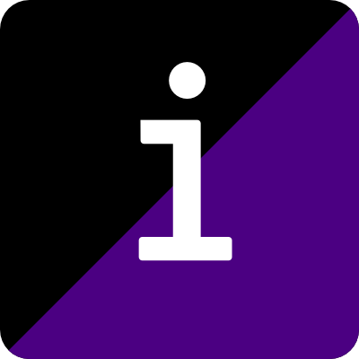

# Indiego

Socially aware Hugo blog starter kit, with modular CSS gulp.js workflow

## Requires

* [Git](https://git-scm.com/)
* [Node & npm](https://nodejs.org/en/)
* Basic understanding of [the command line](https://en.wikipedia.org/wiki/Command-line_interface)

## To get started

1. Click the big button above
2. In a terminal, `git clone` your new repository to your local machine
3. Add your details to [`config.yml`](https://github.com/growdigital/indiego/blob/master/config.yml)
4. Change directory, run `hugo serve`
5. In new terminal, cd `themes/starter/`
6. Run `npm install` 
7. Run `gulp`. A [Browserync](https://www.browsersync.io/) window should open.
8. Add content. Design your theme. The world is your oyster 🐚

Full Hugo documentation at [gohugo.io](https://gohugo.io/) and Indiego documenation at [www.indiego.org.uk](https://www.indiego.org.uk/)

## To add content

* To create new blog post, from command line in top level directory, run `hugo new blog/your-blog-post-name.md`
* To create new status post, run `hugo new status/yourstatuspostname.md`
  * So that I can search status posts by date, I add a 6-digit datestamp eg `180803-shorttitle`
  * Status posts use the date as the `<h1>`, they don’t really have a title as such
* To create a new page, pop a Markdown file in the `content` directory. Use the `about.md` page to crib the [Frontmatter](https://gohugo.io/content-management/front-matter#readout)

Full documentation is on the [Hugo website](https://gohugo.io/content-management/).

## To edit the theme

* The Indiego theme is called **starter**. As you can see, it is incredibly minimal.
* The organisation is based on [ITCSS](https://www.indiego.org.uk/modular/#2-css-organisation) (Inverted Triangle CSS). All CSS, JavaScript and images are organised by modules in the `starter/src` directory, from general to specific:
  1. Variables
  2. Base CSS
  3. Objects (site wide patterns)
  4. Components
  5. Utilities (trumping !important)
  6. Shameful
* A simple [Gulp](https://gulpjs.com/) taskrunner concatenates the individual modules into `app.css`, `app.js` and `assets` in the `starter/static` directory. These are then copied to `public` when you run `hugo serve`
* Set your own base settings in `starter/src/assets/css/settings` 
* Create your own modules in `starter/src/modules`
* Keep `gulp` running in one terminal and `hugo serve` in another to preview changes automatically.

## To publish changes

* If you originally used the [Deploy to Netlify](https://app.netlify.com/start/deploy?repository=https://github.com/growdigital/indiego) button, then every time you `git push`, your website will be automatically deployed. Magic 🙂

